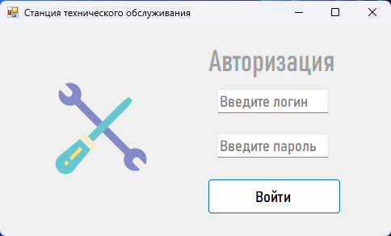
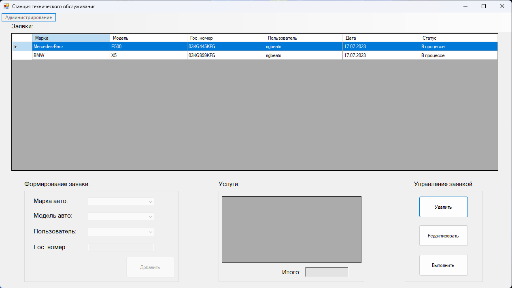

# STO-management-system
Проект создан для удобсвтва и автоматизации процесса по управлению СТО. В частности, для отделения мастеров от клиентов. Подразумевается, что клиент доставит автомобиль на станцию, после чего администратор внесет ее в базу данных и назначит ее ремонт конкретному мастеру. Мастер, в свою очередь, войдя под своей учетной записью увидит новую заявку. После чего он проведет технический осмотр и внесет перечень неисправностей относящихся к машине в программу. После выполнения всех работ он помечает задачу выполненной и берется за слудующий авто. 
___
# Установка
* Скачайие проект по удобному для вас пути.
* После это необходимо изменить сторку подключения к базе данных: ServiceStation.mdf.
  * Для этого внесите новый путь к базе в файл App.config.
* Поздравляю! Проектом можно пользоваться.
___
# Технологии 
* Windows Forms
* Ado.Net
___
# Описание
* Окно авториации (подразумавется, что создать аккаунт может только администратор во вкладке "администрирование")

* Окно программы
  * В верхней таюлице отображаются доступные заявки (список машин на обслуживание);
  * Нижняя часть делится на 3 сегмента:
    * Слева - формирование заявки (доступно только для администратора);
    * По центру - таблица. Здесь отображается список услуг для каждого авто и общая цена за них;
    * Справа - управления заявкой. При помощи центральной кнопки можно управлять услугами.

